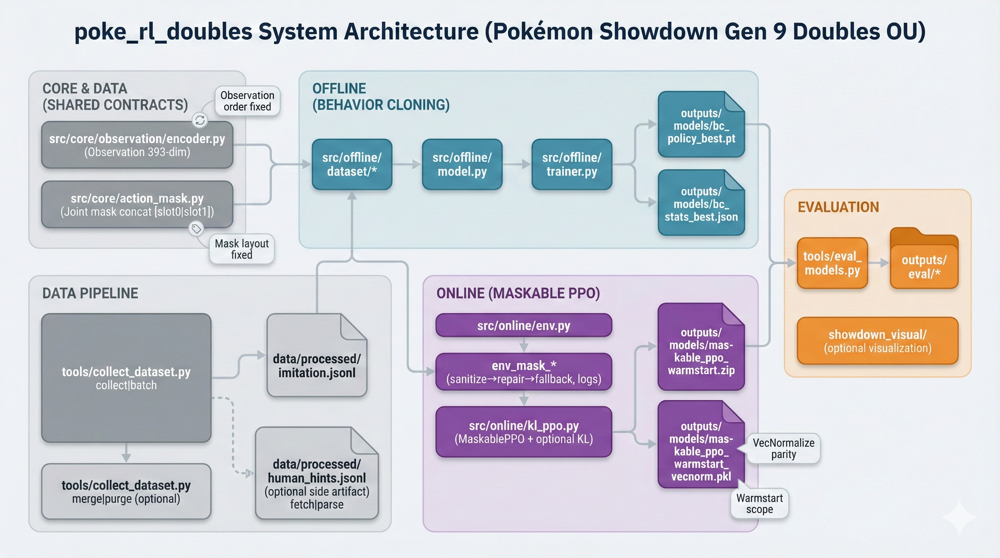

# RL Agent for Pokémon Showdown — Gen 9 Doubles (OU)

Start: Thu, 11 September 2025  
Hand‑in: Thu, 18 December 2025 at 10:00 CET

## Overview
PPO‑based agent built on Stable‑Baselines3 (PyTorch) that plays **Generation 9 Doubles (OU)** via
**poke‑env**. The pipeline is two‑stage: offline imitation learning (behavioral cloning) followed by
online RL fine‑tuning (maskable PPO). Evaluation uses heuristic baselines plus policy cross‑play.



Related demo: [`victorwp288/poke-rl-demo`](https://github.com/victorwp288/poke-rl-demo)

## How to Read This Repo
- Docs hub: [`docs/README.md`](docs/README.md)
- Start with [`docs/codebase_overview.md`](docs/codebase_overview.md) for a fact-checked “map” of what’s where.
- For a guided tour of the **implementation**, read [`docs/CODE_TOUR.md`](docs/CODE_TOUR.md).
- Then read [`docs/ARCHITECTURE.md`](docs/ARCHITECTURE.md) for the component map and core contracts.
- Then read [`docs/DATAFLOW.md`](docs/DATAFLOW.md) for the offline/online/eval pipelines end‑to‑end.
- Use [`docs/CONFIG.md`](docs/CONFIG.md) when you need to understand `config/defaults.yaml`.
- Use [`docs/dev_commands.md`](docs/dev_commands.md) when you just want the command cheat sheet.
- [`docs/codebase_walkthrough.md`](docs/codebase_walkthrough.md) is a short, file‑level tour for quick orientation.

## Quick Start
Prereqs: Python 3.11

```bash
./init.sh
# fallback manual install:
# pip install -r requirements.txt

# smoke‑test the environment
python tests/smoke_test_env.py

# collect imitation data (optional; adjust config/defaults.yaml first)
python tools/collect_dataset.py collect

# merge shard outputs into a single dataset (uses imitation_merge config)
python tools/collect_dataset.py merge

# train the behavior cloning policy
python tools/offline_train.py

# run PPO training (scratch or warmstart)
python tools/online.py scratch
python tools/online.py warmstart

# evaluate saved PPO checkpoints
python tools/eval_models.py --policy scratch=outputs/models/maskable_ppo_scratch_best.zip --episodes 200

# visualize a live battle on a local Showdown server
python showdown_visual/run_showdown_battle.py \
  --model outputs/models/maskable_ppo_warmstart.zip \
  --server-url http://localhost:8000 \
  --log-level summary
```

## Project Structure
- `src/core/` — observation encoding, action masks, shared constants
  - `constants.py` (feature tables), `observation/` (encode_observation), `action_mask.py`
- `src/offline/` — imitation learning pipeline
  - `collect/` (dataset collection), `dataset/` (parsing + filtering),
    `model.py` (BC policy), `train/` (CLI + sweeps), `eval_bc/` (BC eval)
- `src/online/` — PPO training + evaluation utilities
  - `env.py` + `env_mask_*` (maskable env + repair), `policy/` (warmstart + load),
    `train/` (model/callbacks/grid/batch), `eval/` (evaluation suite), `kl_ppo.py`
- `src/data/` — replay fetch + parse utilities used by collectors
- `tools/` — CLI entrypoints for data, training, evaluation
- `showdown_visual/` — local Showdown battle visualizer adapter
- `tests/` — CPU/MPS‑only unit + smoke tests; golden fixtures under `tests/fixtures/`

## Entrypoints (CLI)
Run any tool with `--help` for full flags. Subcommands are optional; omitting a subcommand preserves the
legacy behavior.

- `python tools/online.py [train] MODE [--override key=value ...]` — main PPO entrypoint.
- `python tools/online.py grid [--limit N] [modes ...]` — PPO grid search by config.
- `python tools/online.py batch [modes ...]` — run multiple PPO modes sequentially.

- `python tools/offline_train.py [train] [--dataset-path PATH] [--epochs N] [--device DEV] [--num-workers N] [--batch-size N] [--learning-rate LR]`
  — BC training.
- `python tools/offline_train.py grid [--limit N] [--output PATH] [--offline JSON] [--sweep JSON]`
  — BC grid search.
- `python tools/offline_train.py sweep [--out-dir DIR] [--dataset-path PATH] [--device DEV] [--epochs N] [--num-workers N]`
  — BC sweep over canned trials.
- `python tools/offline_train.py eval-bc [--episodes N] [--opponent KIND] [--opponent-pool CSV] [--checkpoint PATH] [--stats-path PATH] ...`
  — BC vs bots.

- `python tools/eval_models.py [--policy label=path ...] [--episodes N] [--env-mode MODE] [--opponents ...] [--crossplay] [--mirror]`
  — PPO evaluation suite with heuristic/policy opponents.
- `python tools/eval_models.py compare --policy PATH --episodes N [MODE] [--override key=value ...]` — PPO vs heuristics.
- `python tools/eval_models.py suite --policy PATH [--episodes N] [--server-url URL]` — fixed eval suite.
- `python tools/eval_models.py ppo [--checkpoint PATH] [--episodes N] [--battle_format FMT] [--team_path PATH] [--server_url URL]`
  — PPO vs simple heuristics.
- `python tools/eval_models.py bc [--episodes N] [--opponent KIND] [--opponent-pool CSV] [--checkpoint PATH] [--stats-path PATH] ...`
  — BC vs bots.

- `python showdown_visual/run_showdown_battle.py --model PATH [--log-level summary|verbose]`
  — run a live local Showdown battle and print a spectate URL.

- `python tools/collect_dataset.py [collect] [--n-battles N] [--server-url URL] [--battle-format FMT] [--our-team-path PATH] [--opponents ...] ...`
  — collect imitation tuples.
- `python tools/collect_dataset.py batch [--batches NAMES ...] [--override-settings JSON]` — multi‑shard collectors.
- `python tools/collect_dataset.py merge [--sources PATTERN ...] [--output PATH]` — merge JSONL shards.
- `python tools/collect_dataset.py purge [--input PATH] [--output PATH] [--include-draws]` — keep win (and optional draw) records.
- `python tools/collect_dataset.py fetch [--out-dir DIR] [--ids-file PATH] [--urls-file PATH] [--ids ...] [--user USER] [--format FMT] [--limit N] [--rate R] [--user-agent UA] [--overwrite]`
  — download Showdown replays.
- `python tools/collect_dataset.py parse [--raw-dir DIR] [--out-path PATH] [--focus-side {p1,p2}]` — parse tactical hints.

## Configuration
- Defaults live in `config/defaults.yaml`.
- Offline and online training share architecture defaults via `policy_hidden_dim` / `policy_hidden_layers` so warmstarts map cleanly.
- PPO checkpoints save `*_vecnorm.pkl` alongside policies when `use_vecnormalize` is enabled.
- Update YAML to adjust paths, hyperparameters, reward shaping, and opponent schedules.
- See `docs/CONFIG.md` for a concise guide to the keys and contracts.

## Invariants (locked by tests)
- Observation encoding order, dtype, and length (`encode_observation`).
- Slot action mask construction and slot‑0/slot‑1 concatenation order.
- Sanitization → repair behavior and `sanitized_action` / `repaired_action` info flags.
- VecNormalize save/load parity using `<policy_stem>_vecnorm.pkl` during evaluation.
- Warmstart weight mapping: shared MLP layers + action heads only (BC attention is not transferred).
- Opponent schedule phases consume timesteps in order; final phase gets the remainder.

## Tests
- CPU/MPS‑only by design; no full training runs required.
- Run: `pytest`
- Some multi‑worker dataset tests may skip on sandboxed environments that disallow
  `torch_shm_manager`.

## Security & Server Etiquette
- Never commit secrets or account tokens. Prefer environment variables or local config overrides.
- Be polite with Showdown servers: rate‑limit requests and prefer a local server for heavy training.
