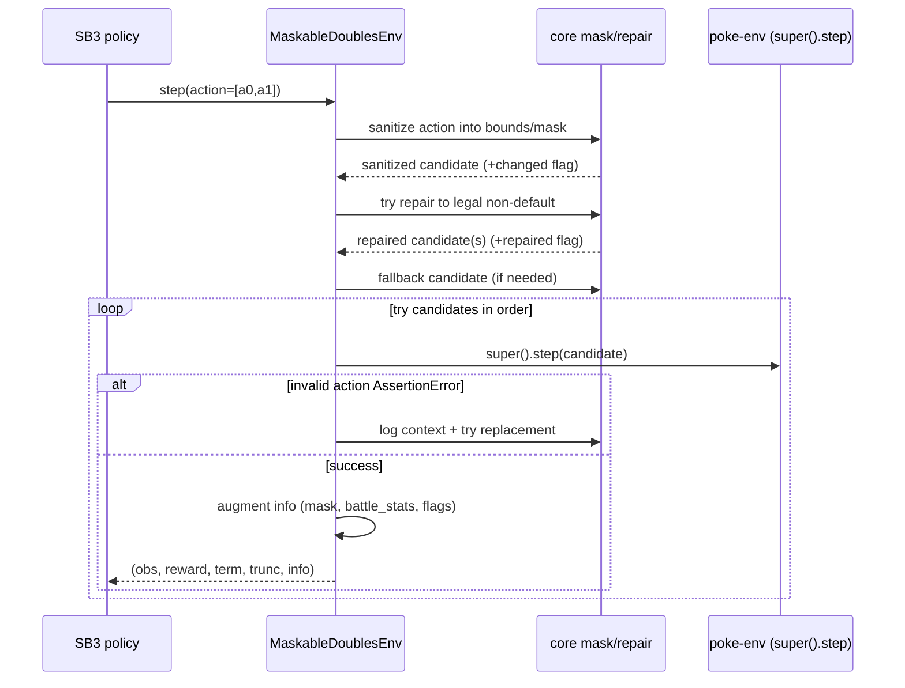

# Code tour (how to read the actual code)

This doc is a guided tour of the **implementation**: the key files, the core symbols inside them,
and where to start when you want to change or debug something.

See also: [`codebase_overview.md`](./codebase_overview.md), [`ARCHITECTURE.md`](./ARCHITECTURE.md),
[`DATAFLOW.md`](./DATAFLOW.md), [`CONFIG.md`](./CONFIG.md), [`EVALUATION.md`](./EVALUATION.md),
[`DATA_SOURCES.md`](./DATA_SOURCES.md), [`README.md`](../README.md).

## How to read this repo efficiently

- **Start at contracts**: `src/core/` is shared by offline + online. If you change observation ordering or mask layout,
  you are changing a compatibility boundary.
- **Treat `tools/` as entrypoints**: most “what runs when I type a command?” questions are answered by following the
  relevant `tools/*.py` shim into `src/...`.
- **Follow artifacts**: if you know the file you want to produce (dataset, checkpoint, vecnorm, eval summary), trace
  backward from the code that writes it.

## Core (shared contracts)

### Observation encoding

| File | Key symbols | What it does | When you touch it |
| :--- | :--- | :--- | :--- |
| `src/core/constants.py` | `FeatureConfig` | Defines sizes + feature config (e.g. `observation_size=393`). | Adding/removing feature blocks; updating sizes. |
| `src/core/observation/encoder.py` | `ObservationEncoder.encode`, `encode_observation`, `OBSERVATION_SIZE` | Builds the fixed-order observation vector via mixins and pads/truncates to 393. | Adding features; fixing encoder bugs; maintaining ordering contract. |
| `src/core/observation/*_features.py` | mixin methods like `_global_state`, `_per_mon` | Actual feature construction logic. | Feature engineering. |

**Contract reminder**: observation ordering is enforced by `tests/test_feature_golden_observation.py` (fixture
`tests/fixtures/golden_observation.npy`).

### Action masks

| File | Key symbols | What it does | When you touch it |
| :--- | :--- | :--- | :--- |
| `src/core/action_mask.py` | `slot_action_mask`, `combine_slot_masks`, `_build_slot_action_mask` | Builds per-slot legality masks and concatenates `[slot0 | slot1]`. Includes caching keyed by battle state. | Fixing legality edge cases; performance improvements; new mechanics/variants. |
| `src/core/env.py` | `action_space_size` | Computes `act_size` (per-slot discrete vocabulary size). | Changing action encoding scheme / support for new gens. |

**Contract reminder**: mask concat order is enforced by `tests/test_feature_golden_mask.py` (fixture
`tests/fixtures/golden_slot_mask.npy`).

## Offline (imitation + behavior cloning)

### Imitation collection (writes the dataset)

| File | Key symbols | What it does |
| :--- | :--- | :--- |
| `src/offline/collect/runner.py` | `play_dataset`, `collect_imitation` | Runs battles against chosen opponents, writes battle summaries. |
| `src/offline/collect/teachers.py` | `RecordingHeuristics.choose_move`, `PolicyTeacherPlayer.choose_move` | Chooses an action (heuristic or policy), computes masks, writes **step records** with `(observation, action, mask)`. |
| `src/offline/collect/recording.py` | `Recorder`, `_battle_summary` | Writes JSONL lines; also emits battle-level summary records. |
| `src/offline/collect/merge.py` | `merge` | Concatenates JSONL shards into a single dataset + writes merge stats. |
| `src/offline/collect/purge.py` | `main` | Filters a mixed JSONL by battle summaries (e.g. keep wins only). |

If you’re editing schemas, start by reading `src/offline/dataset/parsing.py` to see what the loader expects.

### Dataset loading + scanning

| File | Key symbols | What it does |
| :--- | :--- | :--- |
| `src/offline/dataset/parsing.py` | `_parse_payload` | Validates step records and enforces “action must be legal under mask”. |
| `src/offline/dataset/scan.py` | `scan_samples` | Streaming scan: computes byte offsets + mean/std + binary feature flags; skips invalid lines. |
| `src/offline/dataset/indexed.py` | `IndexedJsonlDataset.__getitem__` | Reads JSONL by byte offset and returns `(obs, actions, mask, weight)` tensors. |
| `src/offline/dataset/filters.py` | `_drop_sample`, `_sample_weight` | Drops bad samples and optionally weights samples by outcome/opponent/reward. |

### BC training

| File | Key symbols | What it does |
| :--- | :--- | :--- |
| `src/offline/model.py` | `BehaviorCloningPolicy.forward` | Shared trunk + attention slot queries + per-slot heads. |
| `src/offline/trainer.py` | `BehaviorCloningTrainer.train` | End-to-end BC training loop: scan → split → loaders → train/eval → save best + final. |
| `src/offline/trainer_steps.py` | `_train_epoch`, `_evaluate` | The actual train/eval step logic (loss, AMP, grad accumulation). |
| `src/offline/trainer_io.py` | `_tensorboard_writer`, `_write_stats` | TensorBoard + writing normalization stats JSON. |

**Artifacts**:
- BC checkpoint: `outputs/models/bc_policy*.pt` (a `torch.save()` payload dict containing `state_dict`, `obs_dim`, `action_dim`, and `normalization`).
- Normalization stats: `outputs/models/bc_stats*.json`.

## Online (maskable PPO)

### Environment and step pipeline

| File | Key symbols | What it does |
| :--- | :--- | :--- |
| `src/online/env.py` | `Gen9DoublesEnv`, `MaskableDoublesEnv`, `make_maskable_env` | Poke-env bridge + maskable wrapper (sets mask shape, timeouts, logging). |
| `src/online/env_mask_core.py` | `get_action_mask`, `action_masks`, `_sanitize_action` | Builds masks for SB3 and sanitizes raw actions. |
| `src/online/env_mask_repair.py` | `_candidate_queue`, `_repair_action`, `_safe_action_fallback` | Repair logic: find legal non-default joint orders when possible. |
| `src/online/env_mask_step.py` | `step` | Executes the sanitize→repair→fallback candidate queue and retries on invalid actions. |
| `src/online/env_mask_logging.py` | `_augment_info`, `_write_step_log` | Adds `battle_stats`, `sanitized_action`, `repaired_action` flags, and writes logs. |

#### Diagram: env step pipeline (sanitize → repair → fallback)

### PPO algorithm + warmstart

| File | Key symbols | What it does |
| :--- | :--- | :--- |
| `src/online/kl_ppo.py` | `KLRegularizedMaskablePPO` | MaskablePPO extension that can apply a KL penalty schedule (when configured). |
| `src/online/policy/warmstart.py` | `load_behavior_clone_weights` | Loads a BC checkpoint and copies shared trunk + action heads into PPO policy; can also load normalization stats. |
| `src/online/policy/load.py` | `load_maskable_policy` | Loads an SB3 `.zip` policy and ensures the custom action head is configured. |

## Evaluation code

Start with the CLI and follow subcommands:

| File | Key symbols | What it does |
| :--- | :--- | :--- |
| `tools/eval_models.py` | exports `src/online/eval/cli.py` | Entrypoint shim. |
| `src/online/eval/cli.py` | `main`, subcommands | Routes to `legacy`, `suite`, `compare`, `ppo`, `bc`. |
| `src/online/eval/suite.py` | `main` | Fixed eval suite that writes `eval_suite_<ts>.jsonl` + summary JSON. |
| `src/online/eval/compare.py` | `run_eval` | Single-policy evaluation and CSV summary. |

For the full story, see [`EVALUATION.md`](./EVALUATION.md).

## “Where do I start if I want to…”

- **Add a new observation feature**: `src/core/observation/*` → update `FeatureConfig` sizes → update golden fixture + tests.
- **Fix illegal action issues**: `src/core/action_mask.py` and `src/online/env_mask_repair.py` → watch `outputs/logs/online_env.log`.
- **Change the BC model architecture**: `src/offline/model.py` + `src/offline/trainer.py` (and config defaults).
- **Adjust reward shaping**: `src/online/env_rewards.py` + `config/defaults.yaml`.
- **Change evaluation methodology**: start at `src/online/eval/cli.py` and `docs/EVALUATION.md`.

