# Data sources & provenance

This repo works with two main “data” concepts:

1. **Imitation tuples** (used for training BC): generated by playing battles and recording `(observation, action, mask)`.
2. **Replay-derived hints** (optional side artifact): derived from Showdown replay logs for analysis/enrichment.

See also: [`codebase_overview.md`](./codebase_overview.md), [`DATAFLOW.md`](./DATAFLOW.md),
[`EVALUATION.md`](./EVALUATION.md), [`CONFIG.md`](./CONFIG.md), [`README.md`](../README.md).

## Source A: imitation tuples (used for training)

### What it is

The default training dataset is generated via **local battles** using:

- a **teacher** (scripted heuristics or a saved PPO policy) that chooses actions, and
- a recorder that writes step-level training rows into JSONL.

This is the dataset used by `tools/offline_train.py` via `offline.dataset_path` (default:
`data/processed/imitation.jsonl`).

### How it’s produced

- `python tools/collect_dataset.py collect`
- `python tools/collect_dataset.py batch` (for sharded collection)
- `python tools/collect_dataset.py merge` (to combine shards)
- `python tools/collect_dataset.py purge` (optional: keep win-only battle-tags)

Config knobs live in `config/defaults.yaml`:

- `imitation_collect.*` (single-run collector)
- `imitation_batches.*` (sharded collectors)
- `imitation_merge.*` (merge sources/output)

### Schema

The training loader expects **step records** with required keys:

- `observation`: list[float] of length 393
- `action`: list[int] of length 2 (slot0, slot1)
- `mask`: list[list[int]] shaped `(2, act_size)`

The collector also writes battle-level **summary records** (same JSONL file), used by tools like `purge`.
Scanners and training code skip invalid/non-step records automatically.

The full schema is documented (with examples) in [`codebase_overview.md`](./codebase_overview.md).

## Source B: Showdown replays (optional side artifact)

### What it is

The replay pipeline downloads Showdown replay logs and parses lightweight “hint events” (e.g. protect,
tailwind, switch events). This currently writes:

- `data/raw/downloaded/*` (raw replay files)
- `data/processed/human_hints.jsonl` (parsed hint events)

This is **not** consumed by BC training by default; it’s intended for analysis/enrichment and future
integration.

### How it’s produced

```bash
python tools/collect_dataset.py fetch
python tools/collect_dataset.py parse
```

Where replay IDs/URLs come from:

- `data/sources/replays/ids.txt`
- `data/sources/replays/urls.txt`
- optional “user search” mode via config (`data_fetch.user`, `data_fetch.format`, `data_fetch.limit`)

Config knobs:

- `data_fetch.*` (rate limiting, overwrite, ids/urls/user search)
- `data_parse.*` (raw_dir/out_path/focus_side)

## Teams & opponents (inputs, not “data”)

Many runs depend on a team file:

- `teams/*.txt` are Showdown team exports used for training and eval.
- Config chooses teams via keys like `online.team_path`, `evaluation.*.our_team_path`, etc.

## Etiquette & operational notes

- Prefer a **local Showdown server** for heavy collection/training/eval (default assumes `http://localhost:8000`).
- If you fetch replays from public servers, respect rate limits (`data_fetch.rate`) and robots rules.

## Diagram: data sources at a glance

```mermaid
flowchart TD
  subgraph A["Imitation tuples (training data)"]
    Battles["Local battles (Showdown server)"]
    Collect["tools/collect_dataset.py collect|batch"]
    Shards["data/processed/imitation/shards/*.jsonl"]
    Merge["tools/collect_dataset.py merge"]
    Imit["data/processed/imitation.jsonl"]
  end

  subgraph B["Replay hints (optional)"]
    Ids["data/sources/replays/{ids,urls}.txt"]
    Fetch["tools/collect_dataset.py fetch"]
    Raw["data/raw/downloaded/*"]
    Parse["tools/collect_dataset.py parse"]
    Hints["data/processed/human_hints.jsonl"]
  end

  Battles --> Collect --> Shards --> Merge --> Imit
  Ids --> Fetch --> Raw --> Parse --> Hints
```


