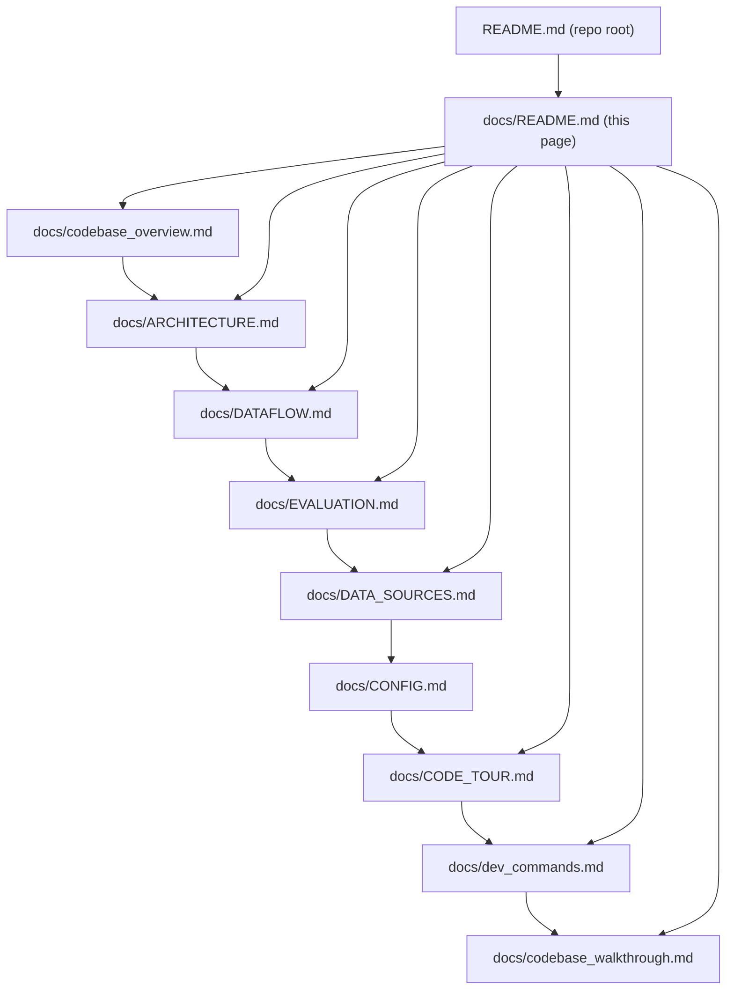

# Docs Hub

This folder contains the project documentation. The goal is that each doc has a clear “job”, and the
docs link together into a coherent reading path.

If you’re starting from scratch, also read the repo root [`README.md`](../README.md).

## System architecture (at a glance)

## Recommended reading paths

### If you want a complete mental model (new contributor)

1. **[`codebase_overview.md`](./codebase_overview.md)** — the big-picture narrative + glossary + where things live
2. **[`ARCHITECTURE.md`](./ARCHITECTURE.md)** — contracts you must not break (parity rules)
3. **[`DATAFLOW.md`](./DATAFLOW.md)** — the offline → online → eval pipelines end-to-end
4. **[`EVALUATION.md`](./EVALUATION.md)** — how evaluation works, what outputs mean, and common pitfalls
5. **[`DATA_SOURCES.md`](./DATA_SOURCES.md)** — dataset provenance and replay tooling
6. **[`CONFIG.md`](./CONFIG.md)** — how `config/defaults.yaml` is organized and what keys mean
7. **[`CODE_TOUR.md`](./CODE_TOUR.md)** — how to read the actual implementation (key symbols per file)
8. **[`dev_commands.md`](./dev_commands.md)** — cheat sheet of commands + what they touch
9. **[`codebase_walkthrough.md`](./codebase_walkthrough.md)** — quick file-level tour when you’re lost

### If you are about to change core semantics (features/masks/env)

1. **[`ARCHITECTURE.md`](./ARCHITECTURE.md)** (contracts)
2. **[`codebase_overview.md`](./codebase_overview.md)** (where the code actually is + tests/fixtures)
3. **Tests + fixtures**: start from `tests/test_feature_golden_observation.py`, `tests/test_feature_golden_mask.py`,
   and `tests/test_env_smoke.py` (linked from the overview)

### If you are running experiments (train/eval)

1. **[`dev_commands.md`](./dev_commands.md)** (do the thing)
2. **[`DATAFLOW.md`](./DATAFLOW.md)** (what each stage writes/reads)
3. **[`CONFIG.md`](./CONFIG.md)** (knobs, overrides, and parity gotchas)

## How these docs differ (division of responsibility)

- **`codebase_overview.md`**: “Map + story” — explains what exists and why, plus glossary/artifacts/tests.
- **`ARCHITECTURE.md`**: “Contracts” — what must remain stable for parity.
- **`DATAFLOW.md`**: “Pipelines” — the concrete data movement and artifacts per phase.
- **`EVALUATION.md`**: “Measurement” — commands, outputs, and evaluation gotchas (esp. vecnorm).
- **`DATA_SOURCES.md`**: “Provenance” — where datasets come from and what is (not yet) integrated.
- **`CODE_TOUR.md`**: “Implementation” — key files + symbols and where to change/debug.
- **`CONFIG.md`**: “Knobs” — how to think about `config/defaults.yaml` keys/sections.
- **`dev_commands.md`**: “How to run” — the shortest path to commands and file locations.
- **`codebase_walkthrough.md`**: “Quick tour” — file-level orientation.

## Doc link map (quick visual)

