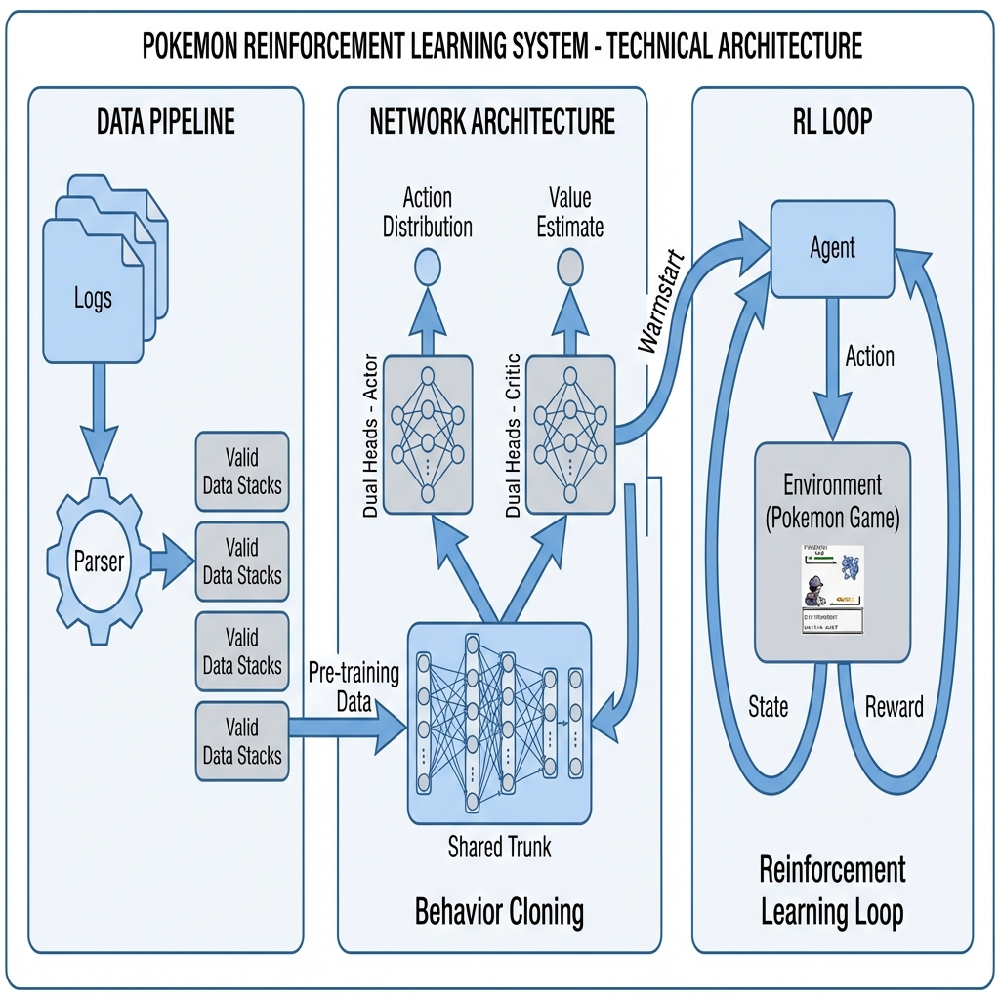
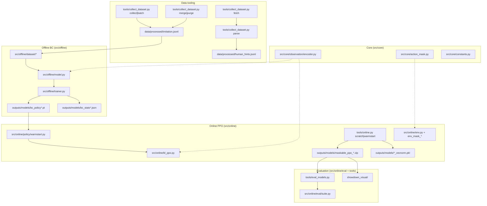
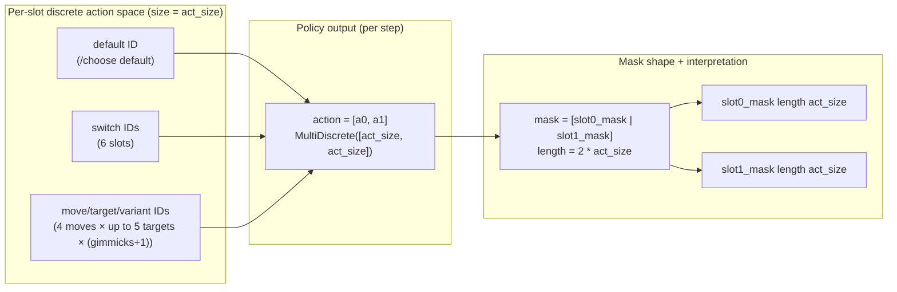
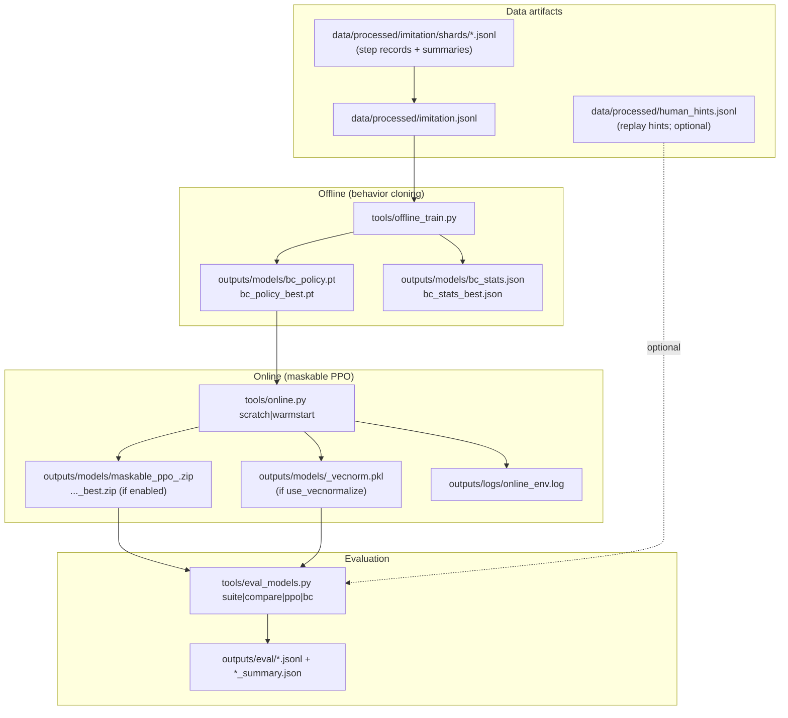

# Codebase Overview: Poke RL Doubles

This document is a **fact-checked map** of the repo: what each subsystem does, how data moves through
it, and which files are the “contracts” you shouldn’t casually change.

It’s also meant to be a bit of a narrative: how we “fly” a reinforcement learning agent from raw
battles and logs to a policy that can play Gen 9 Doubles (OU) reliably.

If you’re new to the project, start from the repo root README first: [`README.md`](../README.md).

## How this doc fits with the other docs

These docs are meant to be complementary (minimal duplication; explicit handoffs):

- **[`docs/README.md`](./README.md)**: docs hub + recommended reading paths.
- **[`ARCHITECTURE.md`](./ARCHITECTURE.md)**: stable contracts + module map — read when changing core semantics.
- **[`DATAFLOW.md`](./DATAFLOW.md)**: end-to-end pipelines (offline → online → eval) — read when running experiments.
- **[`CODE_TOUR.md`](./CODE_TOUR.md)**: guided tour of the actual implementation (key files + symbols).
- **[`CONFIG.md`](./CONFIG.md)**: what’s in `config/defaults.yaml` — read when tweaking knobs.
- **[`dev_commands.md`](./dev_commands.md)**: command cheat sheet — read when you just want to run something.
- **[`codebase_walkthrough.md`](./codebase_walkthrough.md)**: a short “where is what” tour — read when you’re lost.

## Quick navigation

- [High-level pipeline](#high-level-pipeline-what-runs-in-practice)
- [Component map](#component-map-code-dependencies)
- [Deep dive](#deep-dive-the-pieces-youll-touch)
- [Tool belt (CLI)](#the-tool-belt-cli-entrypoints)
- [Contracts & tests](#contracts--tests-where-parity-is-enforced)
- [Config pointers](#configuration-pointers-dont-duplicate-link-instead)
- [Artifacts on disk](#artifacts-on-disk-what-done-looks-like)
- [Common change recipes](#common-change-recipes-safe-ways-to-evolve-the-system)
- [File glossary](#file-glossary-what-lives-where)
- [Terminology glossary](#terminology-glossary-project-specific)
- [Debugging playbook](#debugging-playbook-where-to-look-first)
- [Where do I go next?](#where-do-i-go-next)

## Why this architecture?

Pokémon Doubles has hidden information, a huge action space, and lots of constraints. Training PPO
from scratch tends to be unstable and wastes time exploring illegal/degenerate actions.

We use a two-stage pipeline:

1. **Offline imitation learning (behavior cloning)**: learn a strong prior policy from recorded
   (state, action, mask) tuples.
2. **Online RL fine-tuning (maskable PPO)**: train self-play policies while respecting legality via
   action masking and a sanitize → repair safety path.

## High-level pipeline (what runs in practice)

The default training dataset is **imitation tuples collected via local battles** (heuristic or policy
teacher). Replay tooling exists too, but it currently produces **tactical hint events** rather than a
drop-in BC dataset.

If you want the most operational “do this then that” version of this section, read
[`DATAFLOW.md`](./DATAFLOW.md) and the repo root [`README.md`](../README.md).


_Legacy schematic (still useful as a rough mental model):_


## Component map (code dependencies)

Notice how `src/core/` defines the shared “language” (observation + mask contracts) used everywhere.



## Deep dive: the pieces you’ll touch

### 1) State representation (the “eyes”)

**File:** `src/core/observation/encoder.py`

The observation is a fixed-size vector of **393 floats**. The exact ordering is a train/eval contract
(golden fixtures enforce it), so changes must be append-only and require regenerating fixtures.

If you want intuition: this is the agent’s “retina”. It’s deliberately a flat, normalized vector so
both BC and PPO can share it, and so we can lock compatibility with saved datasets/checkpoints.

The current encoder composition is:

| Block | Count | Notes |
| :--- | ---: | :--- |
| **Base slots (HP/status/types)** | 100 | 4 mons (2 ours + 2 opponent) × (1 HP + 6 status + 18 type one-hot) |
| **Global battle state** | 61 | weather/terrain, turn features, rooms, side conditions, hazards, team fractions |
| **Per-mon features** | 176 | 4 mons × 44: boosts, volatile effects, PP presence, reveal flags, speed hint, etc. |
| **Type matchups** | 12 | coarse effectiveness scalars (truncated) |
| **Priority/fake-out flags** | 6 | priority known (4) + fake-out availability (2) |
| **Type coverage** | 36 | 18 for our team + 18 for opponent team (revealed-only) |
| **Legal action counts** | 2 | per-slot count scalars (moves+switches normalized) |
| **Total** | **393** | padded/truncated to fixed size |

Normalization: values are generally clamped to \([0, 1]\) (e.g., timers, fractions, one-hots).

For the “do not break” contracts, see [`ARCHITECTURE.md`](./ARCHITECTURE.md).

### 2) Action masking (the “rules”)

**File:** `src/core/action_mask.py`

In doubles, legality depends on *joint* choices. The core mask logic:

- enumerates legal single orders per slot (moves/targets/mega/z/dmax/tera + switches),
- joins them into legal joint orders,
- converts those to per-slot action indices, and
- **concatenates masks as `[slot0 | slot1]`** (a stable contract).

Repair is not part of the core mask builder — “sanitize → repair → fallback” is handled in the online
environment mixins (see `src/online/env_mask_repair.py`).

Why it matters: without masking, most of the action space is garbage at any given turn (illegal
targets, trapped switches, disabled moves, etc.). Masking makes exploration meaningful and keeps the
policy from learning pathological “default move” behavior.

### 2b) Action representation (what the policy actually outputs)

The agent’s action is a **2-vector**: one discrete choice for slot 0 and one for slot 1.

- **Where it’s defined**: `src/online/env.py` uses a `spaces.MultiDiscrete` action space (two integers).
- **Per-slot action vocabulary size**: `act_size = action_space_size(battle_format)` from `src/core/env.py`.

`act_size` is computed as:

- `1` default (“pass / choose default”)
- `+ 6` switch slots (Showdown teams are 6 mons; the mask disables illegal/self-switch cases)
- `+ 4 * 5 * (gimmicks + 1)` for move+target+variant combinations  
  (4 move slots, up to 5 target codes, and a generation-dependent “variant” multiplier; the code
  supports mega/z/dynamax/tera-style variants when the battle format exposes them)

The legality mask you see in datasets and in `action_masks()` is a **boolean vector of shape**
`(2 * act_size,)` that is interpreted as `[slot0_mask | slot1_mask]`.

#### Diagram: action-space anatomy



### 3) The behavior cloning model (offline prior)

**File:** `src/offline/model.py`

The BC policy is a shared MLP trunk plus per-slot heads, with learned slot queries via attention so
the model can produce *coordinated* actions for slot 0 and slot 1.

This is the “concept network”: it gives the RL phase a strong starting point so PPO is refining
strategy instead of rediscovering basic legality and common play patterns from scratch.

### 4) Online learning (maskable PPO + optional KL regularization)

**File:** `src/online/kl_ppo.py`

Online training uses **Stable Baselines 3 + `sb3-contrib` MaskablePPO** with:

- `action_masks()` supplied by the environment wrapper,
- optional KL penalty schedule to stay close to a reference policy, and
- checkpointing + (optional) VecNormalize save/load parity.

You can think of online training as “sharpening”: self-play and reward shaping push win-rate, while
the legality + repair pipeline keeps training stable under exploration.

### 5) Gymnasium environment wrapper (poke-env ↔ SB3)

**File:** `src/online/env.py` (and `src/online/env_mask_*.py`)

Key classes:

- **`Gen9DoublesEnv`**: `poke-env` `DoublesEnv` with fixed observation space (393-dim vector) and a
  reward function.
- **`MaskableDoublesEnv`**: `SingleAgentWrapper` + mixins for masking, sanitize/repair, logging, and
  step timeouts.

Important integration detail: the mask API exposed to SB3 is **`action_masks()`** (not
`valid_action_mask()`).

Logs are written to `outputs/logs/online_env.log`.

This layer is where most “safety engineering” lives: timeouts, action sanitization, repair, and
consistent logging/metrics so training runs are debuggable instead of mysterious.

### 6) Dataset format (what “imitation.jsonl” contains)

The collector writes **two kinds of records** into the same JSONL file:

1. **Step records** (used for training): created in `src/offline/collect/teachers.py` and parsed by
   `src/offline/dataset/parsing.py`.
2. **Battle summary records** (metadata): written by `src/offline/collect/runner.py` so utilities
   like `purge` can filter by win/loss/timeout. Scanners skip these during training.

This “mixed JSONL” format is intentional: you can keep one artifact on disk that supports both
training (step records) and dataset hygiene (summary records).

#### Step record schema (required keys)

```json
{
  "battle_tag": "battle-gen9doublesou-...",
  "turn": 7,
  "teacher": "policy",
  "format": "gen9doublesou",
  "observation": [0.0, 1.0, "... 393 floats total ..."],
  "action": [12, 3],
  "mask": [[0, 1, "... act_size ..."], [0, 0, "... act_size ..."]]
}
```

- `observation`: list[float] of length 393
- `action`: list[int] of length 2 (slot0, slot1), each must be legal under its slot mask
- `mask`: list of 2 slot masks, each `list[int]` of length `act_size`

#### Battle summary schema (commonly present)

```json
{
  "battle_tag": "battle-gen9doublesou-...",
  "result": "win",
  "turns": 19,
  "timeout": false,
  "error": null,
  "opponent": "simple",
  "teacher": "policy",
  "format": "gen9doublesou"
}
```

### 7) Memory-efficient loading (streaming JSONL)

**File:** `src/offline/dataset/indexed.py`

`IndexedJsonlDataset` reads JSONL records on-demand using byte offsets computed by `scan_samples`,
allowing large datasets without loading everything into RAM.

### 8) Evaluation

**Files:** `src/online/eval/*`, entrypoint `tools/eval_models.py`

Evaluation loads policies (and the matching `<policy>_vecnorm.pkl` when enabled) and runs suites or
head-to-head comparisons against heuristic/policy opponents.

If you’re debugging “why did this policy get worse?”, evaluation is where you pin it down: fixed
opponents, consistent vecnorm parity, and comparable summaries under `outputs/eval/`.

For the full evaluation story (commands, subcommands, outputs, methodology), see
[`EVALUATION.md`](./EVALUATION.md).

## The tool belt (CLI entrypoints)

Most workflows happen through `tools/` (thin wrappers around `src/` modules):

- **`tools/collect_dataset.py`**
  - `collect` / `batch`: run local battles and write imitation tuples to `data/processed/*.jsonl`
  - `merge`: concatenate JSONL shards into a single dataset
  - `purge`: keep win (and optional draw) battle-tags based on summary records
  - `fetch`: download Showdown replay logs into `data/raw/downloaded`
  - `parse`: parse tactical hint events from replay logs into `data/processed/human_hints.jsonl`
- **`tools/offline_train.py`**: train BC + export `outputs/models/bc_policy*.pt` and `bc_stats*.json`
- **`tools/online.py`**: train PPO (`scratch` / `warmstart`) and save `maskable_ppo_*.zip` (+ vecnorm)
- **`tools/eval_models.py`**: evaluate PPO and BC policies and write summaries under `outputs/eval/`

For a command cheat sheet, see [`dev_commands.md`](./dev_commands.md).

## Data sources (what the system learns from)

There are two main “data sources” in this repo:

- **Imitation tuples (default training data)**: generated by playing battles and recording
  `(observation, action, mask)` tuples into `data/processed/imitation*.jsonl`.
- **Showdown replay hints (optional side artifact)**: fetched/parsed replay logs into
  `data/processed/human_hints.jsonl` for analysis/enrichment.

For details (provenance, schema expectations, and how to reproduce), see
[`DATA_SOURCES.md`](./DATA_SOURCES.md).

## Contracts & tests (where parity is enforced)

If you change anything that affects train/eval parity, expect to update golden fixtures and/or tests.
The key enforcement points:

- **Observation order/length**: `tests/test_feature_golden_observation.py` (fixture: `tests/fixtures/golden_observation.npy`)
- **Mask concat order**: `tests/test_feature_golden_mask.py` (fixture: `tests/fixtures/golden_slot_mask.npy`)
- **Sanitize → repair info flags + mask dtype/order**: `tests/test_env_smoke.py`
- **Dataset parsing invariants** (actions must be legal under masks): `src/offline/dataset/parsing.py` (used by `scan_samples` / loaders)

If you’re making a deep change, also skim `docs/ARCHITECTURE.md` for the “Do Not Break” list.

## Configuration pointers (don’t duplicate; link instead)

All defaults live in `config/defaults.yaml`. For what each key does (and which ones are contracts),
use [`CONFIG.md`](./CONFIG.md).

Two common “gotchas”:

- **Warmstart alignment**: keep `offline.hidden_*` aligned with `online.policy_hidden_*` so weights
  map cleanly.
- **VecNormalize parity**: if `online.use_vecnormalize: true`, evaluation must load the saved
  `*_vecnorm.pkl` for fair comparisons.

### A few “top tunables” (examples)

This is intentionally not exhaustive (that lives in [`CONFIG.md`](./CONFIG.md)), but these are the
first knobs people usually touch:

- **Offline (BC)**:
  - `offline.learning_rate`
  - `offline.epochs`
  - `offline.batch_size`
- **Online (PPO)**:
  - `online.base_rewards.*` (reward shaping)
  - `online.modes.<mode>.total_timesteps`
  - `online.modes.<mode>.kl_coef_*` (when using KL regularization)

## Monitoring results

We use TensorBoard for both offline and online runs:

- `tensorboard --logdir outputs/tensorboard`

Useful signals to watch:

- **Offline**: `loss/train`, `loss/val`
- **Online** (common SB3 metrics): `rollout/ep_rew_mean`, `train/approx_kl`, plus custom logs depending on mode

## Artifacts on disk (what “done” looks like)

When runs succeed, you should typically see:

- **Datasets**
  - `data/processed/imitation.jsonl` (step records + battle summaries)
  - `data/processed/imitation/shards/*` (if using batch collectors)
  - `data/processed/human_hints.jsonl` (from replay parsing; not used by BC training by default)
- **Offline (BC) outputs**
  - `outputs/models/bc_policy.pt` and `outputs/models/bc_policy_best.pt`
  - `outputs/models/bc_stats.json` and `outputs/models/bc_stats_best.json`
  - TensorBoard under `outputs/tensorboard`
- **Online (PPO) outputs**
  - `outputs/models/maskable_ppo_<mode>.zip` (+ `*_best.zip` if enabled by the runner)
  - `outputs/models/<policy_stem>_vecnorm.pkl` when VecNormalize is enabled
  - Environment log: `outputs/logs/online_env.log`
- **Eval outputs**
  - `outputs/eval/*` summaries and jsonl (exact names depend on the subcommand/mode)

#### Diagram: artifact lifecycle (data → models → eval)



## Common change recipes (safe ways to evolve the system)

These are the most common “I want to change X” paths:

- **Add a new observation feature**
  - Update encoder code under `src/core/observation/*`
  - Bump sizes/constants if needed (`src/core/constants.py`)
  - Regenerate fixtures and ensure `tests/test_feature_golden_observation.py` passes
  - Retrain policies; old checkpoints/datasets won’t be compatible if ordering/meaning changes
- **Change action masking**
  - Update `src/core/action_mask.py` and/or the env mask mixins under `src/online/env_mask_*`
  - Ensure `tests/test_feature_golden_mask.py` and `tests/test_env_smoke.py` pass
- **Change rewards**
  - Edit `src/online/env_rewards.py` and/or `config/defaults.yaml` (`online.base_rewards` and mode overrides)
  - Re-evaluate with consistent vecnorm parity (`*_vecnorm.pkl`) before comparing win rates
- **Change training knobs**
  - Prefer config changes (`config/defaults.yaml`) and document them in `docs/CONFIG.md` if they’re “standard”
  - Avoid hardcoding defaults in code unless it’s a contract

## Limitations & known gaps

This project is designed to be practical and testable, but there are real constraints:

- **Local-server dependency for heavy runs**: large-scale collection/training/eval assume a local Showdown server
  (`http://localhost:8000`). Public servers are not appropriate for heavy load.
- **Non-determinism**: battles, exploration, and asynchronous environments introduce randomness; seed control helps
  but won’t make long runs perfectly reproducible.
- **Observation “blind spots”**: some richer temporal features are intentionally absent. For example,
  per-mon “last action categories” are currently stubbed pending better poke-env metadata.
- **Replay hints not integrated**: replay-derived hint events are produced, but not yet used as a first-class
  training signal.
- **Action-space abstraction**: `action_space_size()` is a compact formula; legality is enforced by masks/repair,
  but unusual mechanics/targets can still be tricky at the edges.

## Future work / next steps (ideas)

If you want to extend the system, these are natural next steps:

- **Integrate replay hints** (`data/processed/human_hints.jsonl`) into training as auxiliary targets or filters.
- **Richer temporal features** (e.g. last-action categories, move history summaries) once poke-env exposes them.
- **Stronger evaluation methodology**: more opponent pools, longer suites, and more stable comparisons (e.g. Elo/Glicko).
- **Better dataset tooling**: dataset validation utilities, schema versioning, and explicit fixture regeneration scripts.

## File glossary (what lives where)

This is the “map legend” — a quick directory/file overview. If something ever disagrees with the
code, trust the code (and please fix the doc).

### `src/core/` (shared contracts)

| Path | Purpose |
| :--- | :--- |
| `src/core/constants.py` | Feature config and shared “tables” (e.g. observation size). |
| `src/core/observation/encoder.py` | Fixed-order observation encoding (`encode_observation`). |
| `src/core/action_mask.py` | Slot/joint legality masks and the `[slot0 | slot1]` concatenation contract. |
| `src/core/env.py` | Action space sizing helpers (`action_space_size`). |

### `src/offline/` (behavior cloning + dataset)

| Path | Purpose |
| :--- | :--- |
| `src/offline/collect/*` | Imitation dataset collection (heuristics/policy teachers) + merge/purge tooling. |
| `src/offline/dataset/*` | JSONL parsing, filtering, scanning, and indexed dataset access. |
| `src/offline/model.py` | BC policy network (shared trunk + slot heads + attention slot queries). |
| `src/offline/trainer.py` | BC training loop + checkpoint/stats export. |
| `src/offline/train/*` | Offline training CLI wrappers (grid/sweep/eval-bc entrypoints). |
| `src/offline/eval_bc/*` | BC evaluation against bots / regression utilities. |

### `src/online/` (maskable PPO + environment + eval)

| Path | Purpose |
| :--- | :--- |
| `src/online/env.py` | `Gen9DoublesEnv` + `MaskableDoublesEnv` wrapper factory. |
| `src/online/env_mask_*` | Masking, sanitize→repair pipeline, logging, and stepping mixins. |
| `src/online/env_rewards.py` | Reward computation from battle state. |
| `src/online/kl_ppo.py` | KL-regularized MaskablePPO extension. |
| `src/online/policy/*` | Warmstart + policy load helpers. |
| `src/online/train/*` | PPO init, callbacks, grid/batch orchestration. |
| `src/online/eval/*` | Evaluation suites, episode runners, summaries/IO. |

### `src/data/` (replay utilities)

| Path | Purpose |
| :--- | :--- |
| `src/data/fetch.py` | Fetch Showdown replay logs over HTTP into `data/raw/downloaded`. |
| `src/data/parse.py` | Parse tactical hint events from downloaded logs into `data/processed/human_hints.jsonl`. |

### `tools/` (CLI entrypoints)

| Path | Purpose |
| :--- | :--- |
| `tools/collect_dataset.py` | Dataset tool: `collect|batch|merge|purge|fetch|parse`. |
| `tools/offline_train.py` | Offline BC tool (train/grid/sweep/eval-bc). |
| `tools/online.py` | Online PPO tool (train/grid/batch). |
| `tools/eval_models.py` | Evaluation tool (suite/compare/ppo/bc). |

### Other directories

| Path | Purpose |
| :--- | :--- |
| `config/defaults.yaml` | Default settings for collection/training/eval. |
| `tests/` | Unit + regression tests; golden fixtures live under `tests/fixtures/`. |
| `teams/` | Curated Showdown team exports used by training/eval. |
| `showdown_visual/` | Local Showdown battle visualizer adapter. |

## Terminology glossary (project-specific)

This is a quick reference for the words you’ll see in logs, configs, and code.

- **`slot0` / `slot1`**: our two active Pokémon in doubles. Many contracts are “per-slot” and then concatenated.
- **`act_size`**: the number of discrete action IDs available *per slot* (computed by `action_space_size(battle_format)`).
- **Action vector**: a 2-int vector `[a0, a1]` (one action index per slot), used by SB3 (`spaces.MultiDiscrete([act_size, act_size])`).
- **Mask / action mask**: legal-action indicator for exploration and inference. Stored/used as `[slot0_mask | slot1_mask]` with length `2 * act_size`.
- **Sanitize**: clamp/coerce a raw action into bounds and (if needed) pick a legal masked choice to avoid immediate crashes.
- **Repair**: try to convert a (possibly sanitized) action into a legal *non-default* order when possible; fall back safely if not.
- **Default action / “choose default”**: a “pass-like” placeholder order; we try to avoid learning it as a strategy.
- **Teacher**: the policy that generates actions during imitation collection (`heuristics` or a saved PPO policy).
- **Warmstart**: initialize PPO weights from a BC checkpoint so online training starts from a strong prior.
- **VecNormalize / vecnorm**: SB3 normalization wrapper; if enabled, training saves `<policy>_vecnorm.pkl` and evaluation must reload it.
- **`battle_tag`**: unique identifier for a battle instance; used to associate step records with summary records.

## Debugging playbook (where to look first)

- **Training hangs / battles time out**
  - Check `outputs/logs/online_env.log`
  - Inspect timeout + opponent/team settings in `config/defaults.yaml` (`imitation_collect.battle_timeout`, online mode settings)
- **Policy keeps producing illegal actions**
  - Look for `info["sanitized_action"]` / `info["repaired_action"]` flags (see `tests/test_env_smoke.py`)
  - Verify mask shape/order is correct (`[slot0 | slot1]`) and `act_size` matches the battle format
- **Evaluation numbers look “wrong” or inconsistent**
  - Confirm vecnorm parity: the right `<policy>_vecnorm.pkl` is loaded for that policy
  - Ensure you’re comparing against the same opponent pool and same team files
- **Dataset scan says “no usable records”**
  - Your JSONL might contain only summaries (no step records) or malformed records; scanning skips invalid rows silently
  - Validate step record keys: `observation`, `action` (len 2), `mask` (2 × act_size) and action must be legal under masks

## “Where do I go next?”

- If you want a **docs landing page**: [`docs/README.md`](./README.md)
- If you want the **stable contracts**: [`ARCHITECTURE.md`](./ARCHITECTURE.md)
- If you want the **pipelines as commands**: [`DATAFLOW.md`](./DATAFLOW.md) and [`dev_commands.md`](./dev_commands.md)
- If you want the **knobs and defaults**: [`CONFIG.md`](./CONFIG.md)
- If you want a **quick file tour**: [`codebase_walkthrough.md`](./codebase_walkthrough.md)
